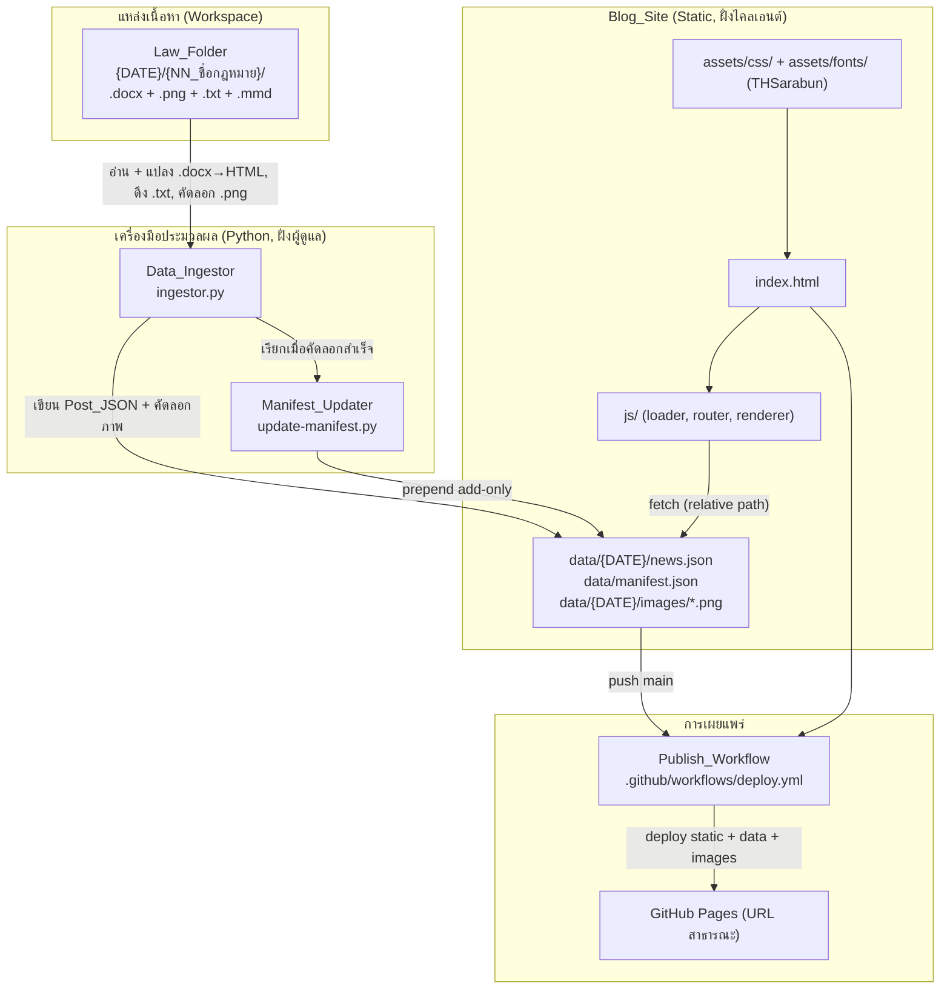
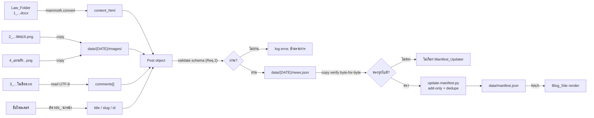
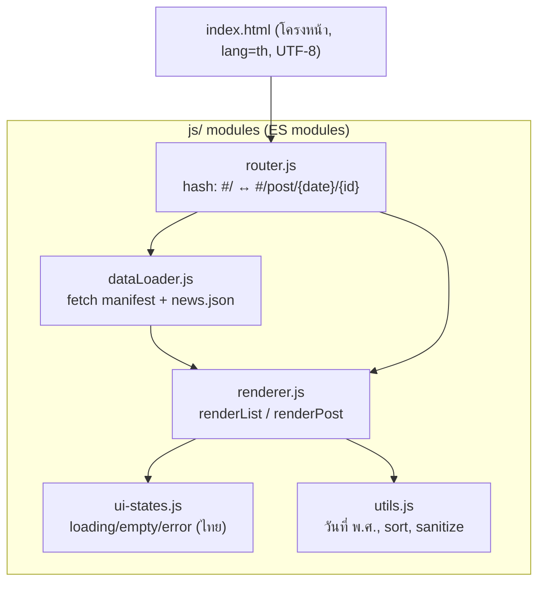

# Design Document — tech-law-blog-site

## Overview

เอกสารออกแบบนี้อธิบายสถาปัตยกรรมของ **เว็บบล็อกกฎหมายเทคโนโลยีแบบ Static** ที่เผยแพร่ผ่าน GitHub Pages ภายใต้หลักการ "1 กฎหมาย = 1 บทความ" โดยเรนเดอร์บทความจากไฟล์ JSON ฝั่งไคลเอนต์ล้วน (ไม่มี server build) ข้อมูลถูกสร้างจากโฟลเดอร์ผลลัพธ์รายกฎหมายของ Pipeline v5.0 (`claude_schedule_prompts.txt`)

ระบบประกอบด้วย 5 องค์ประกอบหลัก:

1. **Blog_Site** — เว็บ Static (`index.html` + `js/` + `assets/css/` + `assets/fonts/`) โหลด JSON แล้วเรนเดอร์ (Requirement 3, 4, 5, 8)
2. **Data_Ingestor** — สคริปต์ Python แปลง Law_Folder → Post_JSON คัดลอกภาพเข้า `data/` (Requirement 1, 2)
3. **Manifest_Updater** — สคริปต์ `update-manifest.py` อัปเดต `manifest.json` แบบ add-only (Requirement 2, 8)
4. **Publish_Workflow** — GitHub Actions เผยแพร่ผ่าน GitHub Pages (Requirement 6)
5. **Pipeline Extension** — ขั้นตอนใหม่ใน `claude_schedule_prompts.txt` สำหรับสร้าง JSON + คัดลอก + เรียก Manifest_Updater ในการรันรายวัน (Requirement 7)

### หลักการออกแบบสำคัญ (Design Decisions & Rationale)

| การตัดสินใจ | เหตุผล | Requirement ที่รองรับ |
| :--- | :--- | :--- |
| Static client-side rendering, ไม่มี build step | สอดคล้อง repo อ้างอิง (`ai-news`, `gov-news-thailand`), GitHub Pages เสิร์ฟไฟล์ตรง ๆ ได้ ลดจุดพัง | 8.6 |
| Data_Ingestor เป็น Python | ระบบนิเวศ `.docx` (`mammoth`, `python-docx`) และ JSON/UTF-8 ครบถ้วนใน Python; สอดคล้อง `update-manifest.py` ที่เป็น Python อยู่แล้ว | 1, 2 |
| แปลง `.docx` ด้วย `mammoth` | `mammoth` แปลง `.docx → semantic HTML` รักษาหัวข้อ/ตาราง/ตัวหนา และคง Unicode ไทยไว้ครบ เหมาะกับ `content_html` มากกว่า raw `python-docx` | 1.1, 2.1 |
| ภาพเก็บใต้ `data/{DATE}/images/` | ทำให้ Post_JSON อ้างอิงภาพด้วย relative path ที่ทำงานได้ทั้ง local และ sub-path ของ GitHub Pages | 6.4, 2.1 |
| Manifest add-only + dedupe-by-id | ป้องกันการสูญหายของบทความเก่าเมื่อรันซ้ำ เป็นหัวใจความถูกต้องของระบบ | 2.4, 2.5, 7.5 |
| Thai-100% naming คงเดิม | คงกฎเหล็กของ Skill; `slug`/`id` ใช้ภาษาไทยได้ (URL-encoded) | 7.9, 5.4 |

## Architecture

### แผนภาพองค์ประกอบ (Component Diagram)



### แผนภาพลำดับข้อมูล (Data-Flow Diagram)



### สถาปัตยกรรมฝั่งไคลเอนต์ (Client Runtime)

Blog_Site ใช้สถาปัตยกรรม hash-based routing บนหน้าเดียว (`index.html`) แยกความรับผิดชอบเป็นโมดูล:



## Components and Interfaces

### 1. Data_Ingestor (`ingestor.py`)

หน้าที่: เดินสำรวจ `{DATE}/` แปลงแต่ละ Law_Folder เป็น Post object แล้วเขียน `data/{DATE}/news.json` พร้อมคัดลอกภาพ

อินเทอร์เฟซ (ฟังก์ชันหลัก — ออกแบบให้เป็น pure function เท่าที่เป็นไปได้เพื่อทดสอบง่าย):

```python
def derive_title(folder_name: str) -> str:
    """ตัดเลขลำดับนำหน้า + underscore เริ่มต้นออก (Req 1.10).
    '07_ระเบียบคณะกรรมการนโยบายศูนย์ข้อมูล_2569'
      -> 'ระเบียบคณะกรรมการนโยบายศูนย์ข้อมูล_2569'"""

def derive_slug(title: str) -> str:
    """สร้าง slug คงภาษาไทย (ไม่ทับศัพท์อังกฤษ), 1..200 อักขระ (Req 2.1, 7.9)."""

def derive_id(folder_name: str, date: str) -> str:
    """id เสถียร ไม่ซ้ำภายในรอบวันที่ (Req 2.1). ใช้ prefix เลขลำดับ + slug hash."""

def convert_docx_to_html(docx_path: Path) -> str:
    """แปลง .docx เป็น HTML ด้วย mammoth; คง Unicode ไทย, หัวข้อ, ตาราง (Req 1.1).
    โยน DocxConversionError หากอ่าน/แปลงไม่ได้ (Req 1.9)."""

def read_comments(txt_path: Path | None) -> list[str]:
    """อ่าน .txt เป็น UTF-8 คืน comments[] (Req 1.6); None/ไม่พบ -> [] (Req 1.7)."""

def resolve_image(folder: Path, filename: str, date: str) -> str:
    """ถ้าพบไฟล์ -> คัดลอกเข้า data/{DATE}/images/ คืน relative path;
    ถ้าไม่พบ -> '' (Req 1.2, 1.3, 1.4, 1.5, 6.4)."""

def build_post(folder: Path, date: str) -> Post | None:
    """ประกอบ Post; ถ้าไม่มี .docx หลัก -> None + log (Req 1.8);
    ถ้าแปลง .docx ล้มเหลว -> None + log แล้วไปโฟลเดอร์ถัดไป (Req 1.9)."""

def ingest_date(date_dir: Path, out_dir: Path) -> IngestResult:
    """เดินทุก Law_Folder -> รวม posts -> validate -> เขียน news.json (UTF-8, Req 2.6).
    ถ้า post ใดไม่ผ่าน schema -> log field/สมาชิกที่ผิด, ไม่เขียนทับ (Req 2.7)."""
```

พฤติกรรมสำคัญ:
- **Idempotent**: รัน `ingest_date` ซ้ำบน input เดิมให้ผล `news.json` ตรงกันทุกไบต์ (ยกเว้น `generated_at`) และคัดลอกภาพทับด้วยเนื้อหาเดียวกัน
- **แยกความล้มเหลวรายโฟลเดอร์**: โฟลเดอร์เสีย 1 อันไม่ทำให้ทั้งรอบล้ม (Req 1.9)

### 2. Manifest_Updater (`update-manifest.py`)

อินเทอร์เฟซ:

```python
def load_manifest(path: Path) -> dict:
    """อ่าน + parse manifest.json (UTF-8). ถ้า parse ไม่ได้ -> โยน ManifestParseError
    (caller ต้องคงไฟล์เดิมไว้, Req 2.8)."""

def merge_entry(manifest: dict, date: str, news_path: str, ids: list[str]) -> dict:
    """add-only: ไม่ลบ/ไม่เขียนทับ entry เดิม (Req 2.4);
    id ซ้ำในรอบวันที่เดียวกัน -> คงเดิม ไม่เพิ่มซ้ำ (Req 2.5)."""

def update_manifest(manifest_path: Path, news_json_path: Path) -> UpdateResult:
    """อ่าน news.json (ถ้าไม่พบ/อ่านไม่ได้ -> ไม่แก้ manifest + error, Req 8.5);
    merge แบบ add-only แล้วเขียนกลับ UTF-8."""
```

CLI: `python update-manifest.py --manifest data/manifest.json --news data/{DATE}/news.json`

### 3. Blog_Site — JS Interfaces

```javascript
// dataLoader.js
async function loadManifest();              // -> {entries: [...]}  (Req 3.1, 8.6)
async function loadNews(newsPath);          // -> {date, generated_at, posts:[...]}
// ทั้งคู่ throw DataLoadError เมื่อ fetch/parse ล้มเหลว (Req 3.5, 8.7)

// router.js  — hash routing
// '#/'                     -> Listing_View
// '#/post/{date}/{id}'     -> Post_View

// renderer.js
function renderList(posts);   // เรียงวันที่ล่าสุด→เก่า, ชื่อไทย tie-break (Req 3.2, 3.3)
function renderPost(post);    // หัว → content_html → ภาพ → ความเห็น (Req 4.2)

// ui-states.js
function showLoading(); function showEmpty();   // "ยังไม่มีบทความ" (Req 3.6)
function showError(msgTh, onRetry);             // ข้อความไทย + ปุ่มลองใหม่ (Req 3.5, 8.7)

// utils.js
function toBuddhistDate(iso);  // 'YYYY-MM-DD' -> 'วัน/เดือน/ปี พ.ศ.' (Req 3.2, 4.1)
function sortPosts(posts);     // Announcement_Date desc, title th-locale asc (Req 3.3)
```

### 4. Publish_Workflow (`.github/workflows/deploy.yml`)

- Trigger: `on: push: branches: [main]` (Req 6.2)
- Job: ตรวจไฟล์อ้างอิงครบ → อัปโหลด artifact ทั้ง static + `data/` + images → `deploy-pages` (Req 6.3, 6.5)
- ถ้าไฟล์อ้างอิงหาย: step ตรวจสอบ fail ทำให้ deploy ไม่เกิด คงของเดิมไว้ (Req 6.6, 6.7)

## Data Models

### Post object (สมาชิกใน `posts[]`) — Req 2.1

```json
{
  "id": "07-ระเบียบคณะกรรมการนโยบายศูนย์ข้อมูล-2569",
  "slug": "ระเบียบคณะกรรมการนโยบายศูนย์ข้อมูล-2569",
  "title": "ระเบียบคณะกรรมการนโยบายศูนย์ข้อมูล_2569",
  "announcement_date": "2026-09-28",
  "content_html": "<h1>...</h1><p>เนื้อหาสรุปและเปรียบเทียบ...</p>",
  "infographic_image": "images/07_ภาพอินโฟกราฟิก_แนวตั้ง_9ต่อ16.png",
  "relationship_image": "images/07_แผนผังความสัมพันธ์กฎหมายและบุคคล.png",
  "comments": ["🚨 [สรุปด่วนกฎหมายไอทีใหม่] ..."],
  "source_url": "https://ratchakitcha.soc.go.th/...",
  "tags": ["ศูนย์ข้อมูล", "ธรรมาภิบาลข้อมูล"]
}
```

ข้อจำกัดฟิลด์ (ใช้ตรวจสอบใน validator — Req 2.1, 2.7):

| ฟิลด์ | ชนิด | ข้อจำกัด |
| :--- | :--- | :--- |
| `id` | string | 1..128, ไม่ซ้ำภายใน `news.json` เดียวกัน |
| `slug` | string | 1..200 |
| `title` | string | 1..500 |
| `announcement_date` | string | ตรงรูปแบบ `YYYY-MM-DD` (ISO 8601) |
| `content_html` | string | มีค่า (ไม่ว่าง) |
| `infographic_image` | string | path/URL หรือ `""` (ว่างได้ตาม Req 1.3) |
| `relationship_image` | string | path/URL หรือ `""` (ว่างได้ตาม Req 1.5) |
| `comments` | array\<string\> | 0..1000 สมาชิก |
| `source_url` | string | path/URL |
| `tags` | array\<string\> | 0..50 สมาชิก |

หมายเหตุ: `infographic_image`, `relationship_image`, `comments`, `tags` อนุญาตให้ "ว่าง" ได้ตาม Requirement 1.3/1.5/1.7 ดังนั้น validator ถือว่าฟิลด์เหล่านี้ "มีอยู่ครบ" เมื่อ key ปรากฏและชนิดถูกต้อง แม้ค่าจะเป็น `""` หรือ `[]`; ส่วน `content_html` และฟิลด์ระบุตัวตน (`id`/`slug`/`title`/`announcement_date`) ต้องไม่ว่าง

### Post_JSON (`data/{DATE}/news.json`) — Req 2.2

```json
{
  "date": "2026-09-28",
  "generated_at": "2026-09-28T12:05:30Z",
  "posts": [ /* Post object */ ]
}
```

### manifest.json (`data/manifest.json`) — Req 2.3

```json
{
  "entries": [
    { "date": "2026-09-28", "path": "data/2026-09-28/news.json", "ids": ["07-...", "01-..."] }
  ]
}
```

- คีย์ตรรกะคือ `date` (Req 2.3); เก็บเป็น array เรียงใหม่→เก่าเพื่อ prepend ง่ายและคง add-only (Req 2.4)
- `ids` ใช้ตรวจ dedupe-by-id ภายในรอบวันที่ (Req 2.5)

## Correctness Properties

*A property is a characteristic or behavior that should hold true across all valid executions of a system — essentially, a formal statement about what the system should do. Properties serve as the bridge between human-readable specifications and machine-verifiable correctness guarantees.*

หลังทำ prework และ Property Reflection แล้ว รวมข้อที่ซ้ำรูปแบบเข้าด้วยกัน (1.3/1.5/1.7 รวมเป็นหนึ่ง; 2.4/7.5/8.4 รวมเป็น add-only เดียว; 2.1/2.7 รวมเป็น schema-validity สองทิศทาง; 2.6/5.4 รวมเป็น round-trip เดียว) ได้ properties ดังนี้:

### Property 1: ตัดเลขลำดับนำหน้าออกจากชื่อบทความ

*For any* ชื่อโฟลเดอร์รูปแบบ `NN_<ชื่อไทย>` (NN เป็นตัวเลขนำหน้าตามด้วย underscore), `derive_title` จะคืนค่าเท่ากับ `<ชื่อไทย>` ทุกกรณี โดยผลลัพธ์ต้องไม่ขึ้นต้นด้วยตัวเลขหรือ underscore

**Validates: Requirements 1.10**

### Property 2: ไฟล์ประกอบที่หายไปให้ค่าว่างและยังสร้างบทความได้

*For any* Law_Folder ที่มีไฟล์ `.docx` หลัก และมีไฟล์ประกอบ (อินโฟกราฟิก, ผังความสัมพันธ์, `.txt`) ปรากฏเป็นเซ็ตย่อยใด ๆ ก็ตาม `build_post` จะยังสร้าง Post ได้เสมอ โดยฟิลด์ของไฟล์ที่หายไปมีค่าเป็น `""` (ภาพ) หรือ `[]` (comments) และฟิลด์ของไฟล์ที่มีอยู่ถูกเติมค่า

**Validates: Requirements 1.3, 1.5, 1.7**

### Property 3: ข้ามโฟลเดอร์ที่ไม่มีเอกสารหลัก

*For any* Law_Folder ที่ไม่มีไฟล์ `.docx` เนื้อหาหลัก `build_post` จะคืน `None` (ไม่สร้าง Post) และผลของ `ingest_date` จะไม่มี Post จากโฟลเดอร์นั้น พร้อมบันทึก log ที่ระบุชื่อโฟลเดอร์และสาเหตุ

**Validates: Requirements 1.8**

### Property 4: ความถูกต้องตามสคีมา (สองทิศทาง)

*For any* Post object ที่ทุกฟิลด์บังคับมีค่าและชนิด/ช่วงถูกต้อง validator จะผ่าน; และ *for any* Post ที่ถูกทำให้ฟิลด์บังคับหนึ่งฟิลด์ขาดหาย ว่าง ชนิดผิด หรือค่านอกช่วง validator จะไม่ผ่านและระบุชื่อฟิลด์ที่ผิด โดยไม่เขียนทับข้อมูลเดิม

**Validates: Requirements 2.1, 2.7, 7.1, 7.2**

### Property 5: ตัวระบุซ้ำไม่ถูกเพิ่ม (dedupe-by-id)

*For any* Manifest และรายการใหม่ที่มี `id` บางส่วนซ้ำกับ entry ของรอบวันที่เดียวกัน ผลลัพธ์ของ `merge_entry` จะไม่มี `id` ซ้ำภายในรอบวันที่นั้น และ `id` เดิมที่มีอยู่ก่อนต้องคงอยู่ครบไม่เปลี่ยนแปลง

**Validates: Requirements 2.5**

### Property 6: add-only เป็น superset ไม่ลบไม่ทับ

*For any* Manifest เริ่มต้น และลำดับการ merge ใด ๆ ทุก entry (คู่ `date`/`path`/`ids`) ที่มีอยู่ก่อน merge ต้องยังคงอยู่ครบและไม่ถูกแก้ไขในผลลัพธ์ (ผลลัพธ์เป็น superset ของสถานะเดิม)

**Validates: Requirements 2.4, 7.5, 8.4**

### Property 7: UTF-8 ไทย round-trip

*For any* ข้อความไทย (รวมพยัญชนะ สระ วรรณยุกต์ ผสมตัวเลขอารบิกและอักขระละติน) เมื่อเขียนลง Post_JSON/Manifest เป็น UTF-8 แล้วอ่านกลับ ข้อความที่ได้ต้องเท่ากับต้นฉบับทุกอักขระ (ไม่มี mojibake)

**Validates: Requirements 2.6, 5.4**

### Property 8: การเรียงลำดับหน้ารายการ

*For any* รายการ Law_Post `sortPosts` จะให้ลำดับที่ `announcement_date` ไม่เพิ่มขึ้น (ล่าสุด→เก่า) และเมื่อวันที่เท่ากันชื่อกฎหมายเรียงขึ้นตามลำดับพจนานุกรมไทย

**Validates: Requirements 3.3**

### Property 9: แปลงวันที่เป็น พ.ศ.

*For any* วันที่รูปแบบ ISO 8601 ที่ถูกต้อง `toBuddhistDate` จะให้ปีเท่ากับปี ค.ศ. บวก 543 และวัน/เดือนตรงกับต้นฉบับ ในรูปแบบ วัน/เดือน/ปี พ.ศ.

**Validates: Requirements 3.2, 4.1**

### Property 10: ไฟล์ประกอบว่างต้องไม่เรนเดอร์องค์ประกอบ

*For any* Post ที่ฟิลด์ภาพเป็น `""` DOM ที่เรนเดอร์ต้องไม่มี `` สำหรับช่องนั้น (จำนวน `` เท่ากับจำนวนฟิลด์ภาพที่ไม่ว่าง) และ *for any* Post ที่ `comments` เป็น `[]` DOM ต้องไม่มีส่วน "ความเห็น"

**Validates: Requirements 4.5, 4.6**

### Property 11: คัดลอกไฟล์ตรงทุกไบต์และ gate ต่อ Manifest_Updater

*For any* ไฟล์ต้นทาง เมื่อคัดลอกเข้า `data/` แล้ว ไบต์ปลายทางต้องเท่ากับต้นทางทุกไบต์; และถ้าไบต์ไม่ตรง ระบบต้องไม่เรียก Manifest_Updater ในรอบนั้น

**Validates: Requirements 7.3, 7.4**

### Property 12: ไม่มีรายการใหม่ = ไม่แก้ไฟล์ (no-op invariant)

*For any* สถานะไฟล์ข้อมูลเดิมของ Blog_Site เมื่อรอบการรันมีรายการใหม่เท่ากับ 0 ไฟล์ข้อมูลทุกไฟล์ต้องเหมือนเดิมทุกไบต์ และรอบนั้นจบด้วยสถานะสำเร็จ

**Validates: Requirements 7.7**

### Property 13: Ingestor idempotent

*For any* input Law_Folder ชุดเดิม การรัน `ingest_date` ซ้ำจะให้ `posts` เหมือนกันทุกฟิลด์ (ยกเว้น `generated_at`) และไบต์ของภาพที่คัดลอกต้องเท่ากัน

**Validates: Requirements 7.3, 1.1**

## Error Handling

| สถานการณ์ | การจัดการ | Requirement |
| :--- | :--- | :--- |
| ไม่มี `.docx` หลักในโฟลเดอร์ | ข้ามโฟลเดอร์ ไม่สร้าง Post, log ชื่อ+สาเหตุ | 1.8 |
| `.docx` เสียหาย/แปลงไม่ได้ | จับ `DocxConversionError`, ข้ามโฟลเดอร์, log, ทำโฟลเดอร์ถัดไปต่อ | 1.9 |
| ไฟล์ประกอบหาย (png/txt) | ตั้งฟิลด์เป็น `""`/`[]` แล้วทำต่อ | 1.3, 1.5, 1.7 |
| Post ไม่ผ่าน schema | log ฟิลด์/สมาชิกที่ผิด, ไม่เขียนทับ news.json เดิม, ทำรายการอื่นต่อ | 2.7, 7.2 |
| อ่าน/parse manifest เดิมไม่ได้ | โยน `ManifestParseError`, คงไฟล์เดิมไว้, รายงานสาเหตุ | 2.8 |
| ไม่พบ news.json ที่จะเพิ่ม | ไม่แก้ manifest, รายงานไฟล์ที่มีปัญหา | 8.5 |
| คัดลอกไฟล์ไม่ตรงทุกไบต์ | ไม่เรียก Manifest_Updater, คงข้อมูลเดิม, log ไฟล์ที่ล้มเหลว | 7.4 |
| Manifest_Updater ล้มเหลว | คง manifest เดิม, log สาเหตุ | 7.6 |
| fetch/parse JSON ฝั่งเว็บล้มเหลว | แสดงข้อความไทย + ปุ่มลองใหม่ แทนหน้าว่าง | 3.5, 8.7 |
| ไม่มีบทความใน Manifest | แสดง "ยังไม่มีบทความ" (ไทย) | 3.6 |
| ภาพ/ความเห็นว่างในหน้า Post | ไม่แสดงกรอบว่าง/ไอคอนเสีย/ส่วนความเห็นว่าง | 4.5, 4.6 |
| ฟอนต์ THSarabun โหลดไม่ได้ใน 3s | ใช้ฟอนต์ไทยสำรองใน font-family stack | 5.3 |
| ไฟล์อ้างอิงหายตอน deploy | verification step fail, ไม่ทับ deploy เดิม, log ไฟล์ที่หาย | 6.6, 6.7 |

## Testing Strategy

### แนวทางแบบคู่ (Dual Approach)
- **Property tests**: ครอบคลุมตรรกะบริสุทธิ์ที่มีคุณสมบัติสากล (Properties 1–13)
- **Unit/Example tests**: ตัวอย่างเฉพาะ, edge cases, error conditions ที่ไม่ใช่ property
- **Integration/Smoke tests**: การตั้งค่า, การเผยแพร่, และการแสดงผลในเบราว์เซอร์จริง

### เครื่องมือทดสอบ (ไม่พัฒนา PBT engine เอง)
- **Python (Data_Ingestor, Manifest_Updater)**: `pytest` + **Hypothesis** สำหรับ property tests; `mammoth` สำหรับแปลง `.docx`
- **JavaScript (Blog_Site)**: `vitest` + **fast-check** สำหรับ property tests; `jsdom` สำหรับตรวจโครงสร้าง DOM
- Property test แต่ละตัวรันขั้นต่ำ **100 iterations** และติดแท็กอ้างอิง property ในเอกสารนี้

รูปแบบแท็กในโค้ดทดสอบ:
`Feature: tech-law-blog-site, Property {number}: {property_text}`

### การจับคู่ property → การทดสอบ (หนึ่ง property = หนึ่ง property test)

| Property | เครื่องมือ | สิ่งที่สุ่ม (generator) |
| :--- | :--- | :--- |
| 1 derive_title | Hypothesis | เลข NN สุ่ม + ชื่อไทยสุ่ม |
| 2 optional-files | Hypothesis | เซ็ตย่อยของไฟล์ประกอบที่ปรากฏ |
| 3 skip-no-docx | Hypothesis | โฟลเดอร์ที่ไม่มี `.docx` |
| 4 schema-validity | Hypothesis | Post valid + Post ที่ถูก mutate ทีละฟิลด์ |
| 5 dedupe-by-id | Hypothesis | manifest + entry ids ทับซ้อน |
| 6 add-only | Hypothesis | manifest สุ่ม + ลำดับ merge สุ่ม |
| 7 utf8-roundtrip | Hypothesis | ข้อความไทย+เลข+ละตินสุ่ม |
| 8 sort-order | fast-check | อาร์เรย์ posts สุ่ม (วันที่/ชื่อ) |
| 9 buddhist-date | fast-check | วันที่ ISO สุ่ม |
| 10 optional-render | fast-check + jsdom | posts ที่ภาพ/ความเห็นว่างสุ่ม |
| 11 copy-byte-equality | Hypothesis | byte blob สุ่ม |
| 12 no-op-zero-new | Hypothesis | สถานะ data dir สุ่ม, input ว่าง |
| 13 ingest-idempotency | Hypothesis | ชุด Law_Folder สุ่ม (รันซ้ำ) |

### Unit/Example tests
- แปลง `.docx` จริง (fixtures) → HTML ไม่ว่าง + มีหัวข้อไทยที่คาดไว้ (1.1)
- โฟลเดอร์ `.docx` เสียปนกับโฟลเดอร์ดี → ตัวดีถูกสร้าง ตัวเสียถูกข้าม+log (1.9)
- manifest เสียรูป → `update_manifest` รายงาน error, ไบต์ไฟล์ไม่เปลี่ยน (2.8)
- ลำดับองค์ประกอบ Post_View ใน jsdom: หัว < เนื้อหา < ภาพ < ความเห็น (4.2)
- mock loader reject → แสดงข้อความไทย + retry (3.5, 8.7); posts ว่าง → "ยังไม่มีบทความ" (3.6)
- reference checker: ลบไฟล์ที่อ้างอิง → checker fail ระบุชื่อไฟล์ (6.6)

### Smoke/Config tests
- `index.html` มี `lang="th"` และ `<meta charset="utf-8">` (5.1)
- CSS มีกฎ `@font-face` THSarabun ชี้ `assets/fonts/` (5.2); font-family มี fallback ไทย (5.3)
- มี `.nojekyll` ที่ราก, workflow มี trigger `push: main`, ไม่มี asset path ขึ้นต้นด้วย `/` (6.1, 6.2, 6.4)
- มี `update-manifest.py` ที่ราก, โครงสร้าง `js/`+`assets/css/`+`data/` ครบ (8.1, 8.2, 8.3)
- พรอมป์ระบุ 3 ขั้นตอนตามลำดับ: สร้าง Post_JSON → คัดลอก → เรียก Manifest_Updater (7.8)

### Integration tests
- Local static-serve smoke: เปิด `index.html` ผ่าน static server → Listing แสดงภายในเวลาที่ยอมรับได้, คลิกเปิด Post ได้ (3.1, 3.4)
- Thai rendering check (เบราว์เซอร์จริง/visual): ไทยผสมเลข/ละตินไม่เป็น tofu, ฟอนต์ THSarabun ทำงาน (5.3, 5.5)
- Deploy: push `main` → GitHub Actions สำเร็จ, URL สาธารณะตอบ 200 (6.3, 6.5)

## Pipeline Prompt Extension (Requirement 7)

เพิ่ม **สเต็ป 7 (เผยแพร่รายวัน)** ต่อจากสเต็ป 6 ใน `claude_schedule_prompts.txt` โดย **เคารพ Circuit Breaker เดิม** — ถ้าสเต็ป 2 ไม่พบกฎหมายใหม่ (0 รายการ) ให้ยุติทันทีตามเดิม ไม่แตะไฟล์ข้อมูลของ Blog_Site (Req 7.7)

เมื่อพบกฎหมายใหม่ ≥ 1 ฉบับ ให้ทำ 3 ขั้นตอนตามลำดับ (Req 7.8):

1. **สร้าง Post_JSON**: รัน Data_Ingestor แปลงทุก Law_Folder ของรอบวันที่เป็น `data/{DATE}/news.json` ที่ผ่าน schema (Req 2, 7.1); รายการที่ไม่ผ่านให้ log ฟิลด์ที่ผิดและข้าม โดยไม่หยุดรายการอื่น (Req 7.2)
2. **คัดลอกข้อมูล**: คัดลอก `news.json` และภาพทั้งหมดเข้า `data/{DATE}/` แล้ว **ตรวจความตรงกันทุกไบต์**; ถ้าไม่ตรงให้ไม่เรียกขั้นตอนถัดไปและ log ไฟล์ที่ล้มเหลว (Req 7.3, 7.4)
3. **เรียก Manifest_Updater**: เมื่อคัดลอกครบสำเร็จ เรียก `update-manifest.py` เพิ่มเฉพาะรายการใหม่แบบ add-only + dedupe-by-id; ถ้าล้มเหลวให้คง manifest เดิมและ log (Req 7.5, 7.6)

คงกฎ **ชื่อไทย 100%** สำหรับชื่อโฟลเดอร์/ไฟล์รายกฎหมาย (Req 7.9) และคงกฎเหล็กเดิมทั้งหมดของ Skill (ไม่มี git push โดยปริยาย เว้นแต่ผู้ใช้สั่งแยก)
